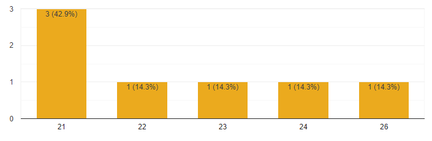
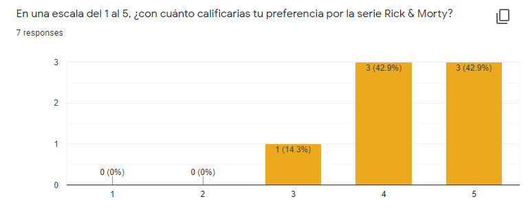
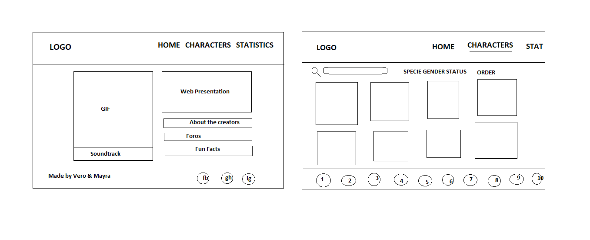
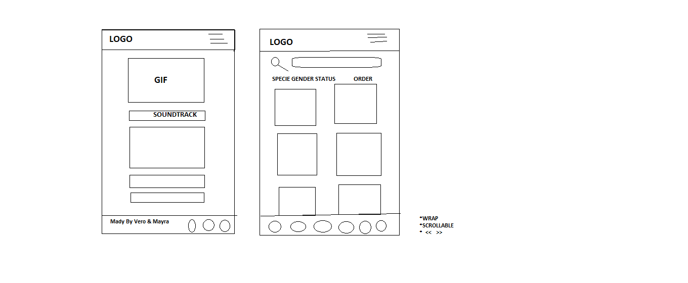
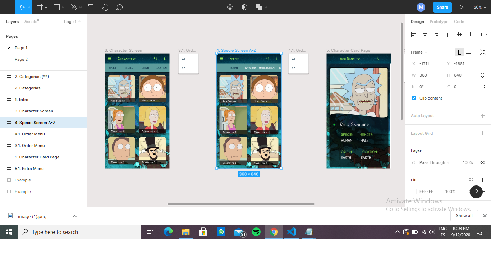

# THE RICK & MORTY DATA 

## Index

* [1. Introduction](#1-introduction)
* [2. Product Definition](#2-product-definition)
* [3. User Research](#3-user-research)

***

## 1. Introduction

The series follows the misadventures of alcoholic scientist Rick and his overly nervous grandson Morty, who split their time between domestic family life and intergalactic travel. Often finding themselves in a heap of trouble that more often than not created through their own actions, these two will get themselves out of trouble in the most entertaining way! This extremely clever show will blow your mind as well as all other parallel realities of your mind!

## 2. Product Definition

The Rick and Morty Data is a web project aimed at Rick and Morty fans, which include the following functionalities: show, filter and sort all the characters in the sitcom. So it makes it easier for potential users to find their favorite characters in a more intuitive and orderly way.

## 3. User Research

General Objective:

* Provide, through a friendly interface, information that generates value to users interested in the Rick & Morty sitcom.

Especific Objectives:

* Design the app thinking and understanding the user.
* Determine the most relevant data that users want to see in the interface and why.
* Determine when users use or would use the product.

About the research

Metodology and findings:

Four face-to-face interview and seven qualitative surveys were conducted with potential users. On one hand, a little more than fifty per cent of our sample, indicated being Rick & Morty's fan. On the other hand, the rest of people indicated only 'liked' it. In addition to this, a range between 21 and 26 years old was identified as an age group. However, when making a comparison with universal statistics, the target market that usually watches this sitcom is between the ages of 25 and 35. Therefore, combining both findings, it was established that our target includes any person, without distinguishing age, who is characterized by being 'jovial', a significant personality trait among people who meet the aforementioned age ranges.

Basis for User Stories:

User Stories' definition was based by answering main four questions:
1. What do you like/interest about Rick & Morty?
2. Have you ever searched something regarding Rick & Morty in the web?
3. If you would create your own Rick & Morty website, what would you include inside?
4. When do you consider necessary to use this website?

User Stories

For planning, user stories was defined under Scrum Agile Metodologhy, which was developed through software tool Jira.

1. Filter character by a criteria (specie, gender and status)
2. Sort characters alphabetically (ascending and descending)
3. Show detail of a character by clicking on its image
4. Search characters by name (search bar)

Prototypes

1. Low Fidelity

2. Hight Fidelity

